# 状態遷移図 — StateTransitionConfig

> このファイルは StateTransitionConfig.asset の内容を Mermaid 図として表現したものです。
> VS Code（Markdown Preview Mermaid Support 拡張）、GitHub、Notion などで描画できます。

```mermaid
stateDiagram-v2
    direction LR

    [*] --> Guarded

    %% ① Guarded
    Guarded --> Defensive       : Resistance≥0.8
    Guarded --> Defensive       : Above 5秒
    Guarded --> Acclimating     : Within 8秒 + Arousal≥0.4
    Guarded --> Acclimating     : Below 5秒 + Arousal≥0.4

    %% ② Defensive
    Defensive --> Guarded           : Resistance≤0.4
    Defensive --> Overridden        : Fatigue≥0.9 + Drive≥0.7
    Defensive --> FrustratedCraving : Stop 5秒 + Drive≥0.7
    Defensive --> FrustratedCraving : Below 5秒 + Drive≥0.7

    %% ③ Overridden
    Overridden --> End_A            : [END_A] 射精≥2回 + Fatigue≥0.9
    Overridden --> Defensive        : Arousal≤0.35 + Fatigue≤0.9
    Overridden --> Acclimating      : Arousal≥0.4 + Fatigue≤0.9
    Overridden --> FrustratedCraving: Below 5秒 + Drive≥0.7

    %% ④ FrustratedCraving
    FrustratedCraving --> Acclimating : Fatigue≥0.7
    FrustratedCraving --> Surrendered : Within 5秒 + Drive≥0.7
    FrustratedCraving --> Surrendered : Below 5秒 + Arousal≥0.65
    FrustratedCraving --> Acclimating : Resistance≤0.4 + Arousal≥0.4

    %% ⑤ Acclimating
    Acclimating --> Surrendered : Within 8秒 + Arousal≥0.65
    Acclimating --> Surrendered : Below 5秒 + Arousal≥0.65
    Acclimating --> BrokenDown  : Above 5秒 + Drive≥0.7 + Arousal≥0.6

    %% ⑥ Surrendered
    Surrendered --> End_B      : [END_B] 射精≥2回 + Fatigue≥0.9
    Surrendered --> BrokenDown : Below 5秒 + Drive≥0.7 + Arousal≥0.6

    %% ⑦ BrokenDown
    BrokenDown --> End_C_White   : [END_C] 射精≥3回 + Fatigue≥0.9 + トロトロ(Mode=2)
    BrokenDown --> End_C_Overload: [END_C] 射精≥3回 + Fatigue≥0.9 + アヘ顔(Mode≥1)

    %% エンド
    End_A        --> [*]
    End_B        --> [*]
    End_C_White  --> [*]
    End_C_Overload --> [*]

    %% スタイル
    classDef endState fill:#c0392b,color:#fff,stroke:#922b21
    class End_A,End_B,End_C_White,End_C_Overload endState
```

## 状態一覧

| 状態 | 説明 |
|------|------|
| **Guarded** | ① 初期状態：心を閉ざして冷や汗 |
| **Defensive** | ② 不機嫌・拒絶 |
| **Overridden** | ③ 強い快感で押し切られる |
| **FrustratedCraving** | ④ お預け：体だけ求めてしまう |
| **Acclimating** | ⑤ 馴化：身体が受け入れていく |
| **Surrendered** | ⑥ 通常快楽落ち |
| **BrokenDown** | ⑦ 理性崩壊・サービスタイム |
| **End_A** | グッタリエンド（③でFatigue閾値） |
| **End_B** | 快楽落ちエンド（⑥でFatigue閾値） |
| **End_C_White** | とろけ落ちエンド（⑦トロトロ） |
| **End_C_Overload** | アヘ顔崩壊エンド（⑦アヘ顔） |

## Band の意味

| Band | 意味 |
|------|------|
| **Stop** | 入力なし（停止中） |
| **Below** | メイン強度 < 耐性下限 |
| **Within** | 耐性下限 ≤ メイン強度 ≤ 耐性上限 |
| **Above** | メイン強度 > 耐性上限 |
